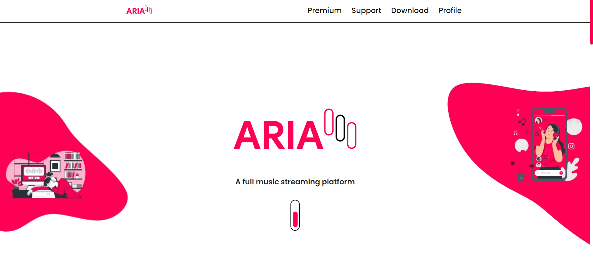
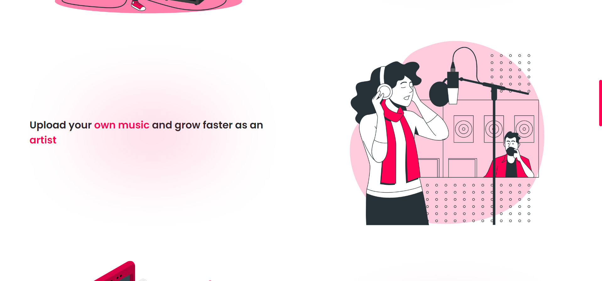
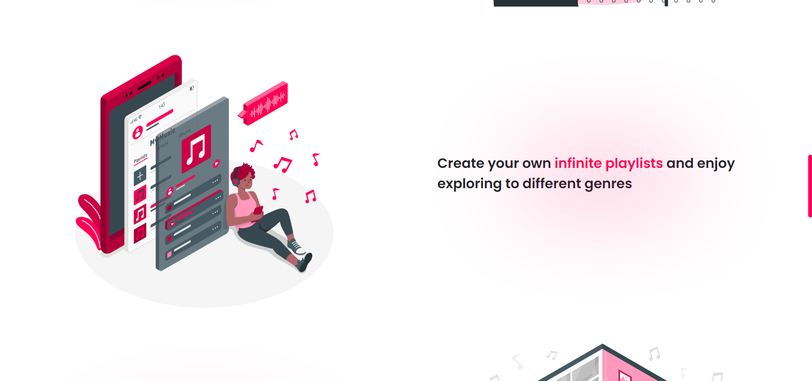
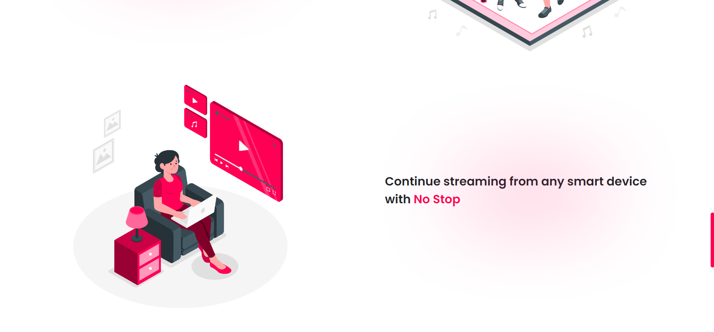
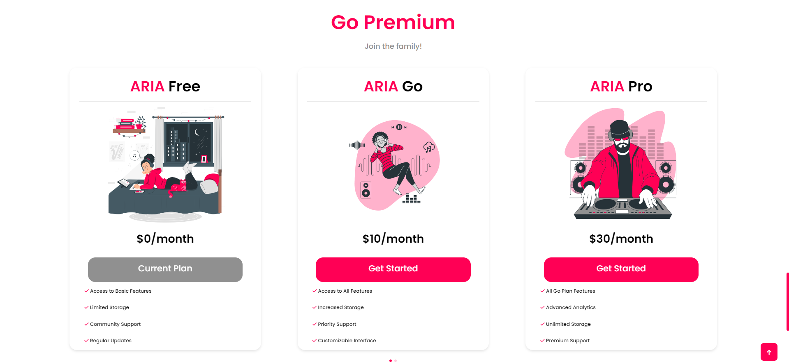
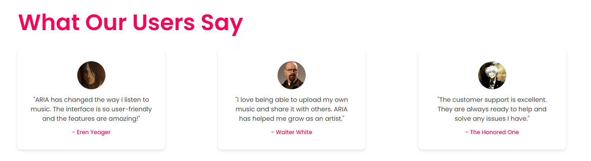

#  ARIA - Music Streaming Platform 

ARIA is a fully-featured music streaming platform designed to give users the ultimate music listening experience. This project was designed using Adobe XD and has been transformed into a real website with stunning animations powered by GSAP.

## ⚠️ Disclaimer

**Important:** ARIA is a conceptual project and is not a real music streaming platform. This idea is my own creation, and no one is permitted to use or replicate this idea without my explicit permission.

## ARIA Features

- **Infinite Playlists:** Create and enjoy endless playlists with your favorite music.
- **Music Uploads:** Upload your own music and grow faster as an artist.
- **Cross-Device Streaming:** Continue streaming from any smart device without interruption.
- **Party Mode:** Enjoy streaming music online with your friends using the Party Mode.
- **Premium Plans:** Choose from various premium plans to enhance your music streaming experience.

## Premium Plans

- **ARIA Free**
  - Access to Basic Features
  - Limited Storage
  - Community Support
  - Regular Updates

- **ARIA Go**
  - Access to All Features
  - Increased Storage
  - Priority Support
  - Customizable Interface
   
- **ARIA Pro**
  - All Go Plan Features
  - Advanced Analytics
  - Unlimited Storage
  - Premium Support

- **ARIA Elite**
  - All Pro Plan Features
  - Dedicated Account Manager
  - Custom Integrations
  - VIP Support

## Screenshots

Here are some screenshots of the ARIA platform:

### Home Page

### Features

### Premium Plans

### Testimonial

### Footer

## Technologies Used

- **HTML**: Structure of the website.
- **CSS**: Styling and responsive design.
- **JavaScript**: Interactive functionality and animations.
- **GSAP (GreenSock Animation Platform)**: Advanced animations for a smooth and dynamic user experience.
- **Swiper.js**: Responsive sliders for the premium plans section.
- **Bootstrap**: Responsive layout and components.
- **Adobe XD**: Initial design and prototyping.

## JavaScript Features

- **GSAP Animations**: 
  - Smooth entrance animations for the navbar, main section (blobs, logo, text, capsule), features, premium plans, testimonials, and footer.
  - Scroll-triggered animations for sections as they enter the viewport.
  - Dynamic loading screen fade-out and a polished scroll-to-top button effect.
- **Swiper.js**: Responsive slider for the premium plans section with breakpoint adjustments.
- **Lazy Loading**: Images load as users scroll, optimizing performance and reducing initial page load time.

### This website is fully responsive!

## License
This project is licensed under the MIT License!
