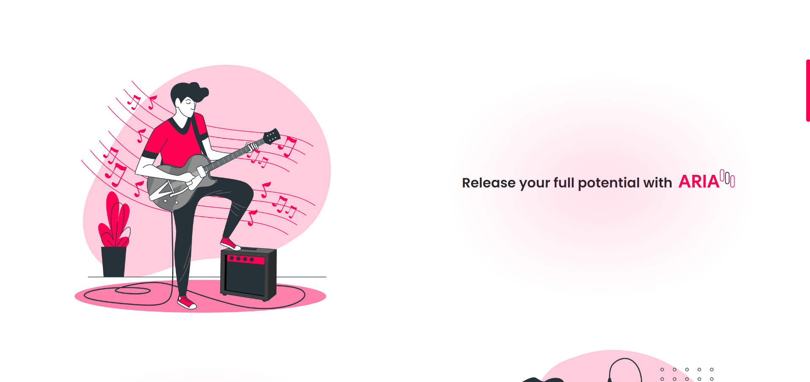
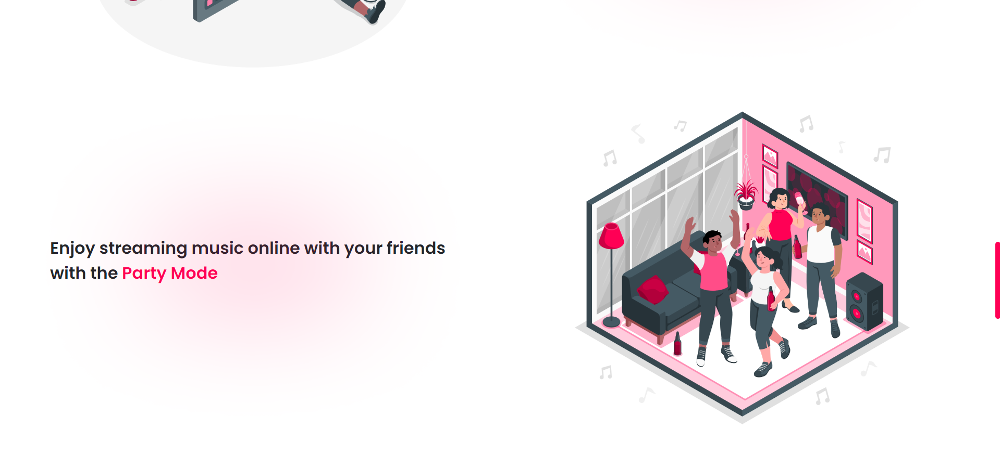

#  ARIA - Music Streaming Platform 

ARIA is a fully-featured music streaming platform designed to give users the ultimate music listening experience. This project was designed using Adobe XD and has been transformed into a real website.

## Disclaimer

**Important:** ARIA is a conceptual project and is not a real music streaming platform. This idea is my own creation, and no one is permitted to use or replicate this idea without my explicit permission.

## Features

- **Infinite Playlists:** Create and enjoy endless playlists with your favorite music.
- **Music Uploads:** Upload your own music and grow faster as an artist.
- **Cross-Device Streaming:** Continue streaming from any smart device without interruption.
- **Party Mode:** Enjoy streaming music online with your friends using the Party Mode.
- **Premium Plans:** Choose from various premium plans to enhance your music streaming experience.

## Premium Plans

- **ARIA Free**
  - Contains ads
  - Only one user per account
  - Free

- **ARIA Go**
  - No ads
  - Up to 5 users per account
  - $15 per month

- **ARIA Pro**
  - No ads
  - Unlimited users per account
  - $30 per month

- **Student Plan:** Special discount for students.

## Screenshots

Here are some screenshots of the ARIA platform:

### Home Page

### Premium Plans

### Footer

## Technologies Used

- HTML
- CSS
- Adobe XD

### This website is fully responsive!

## License
This project is licensed under the MIT License!
